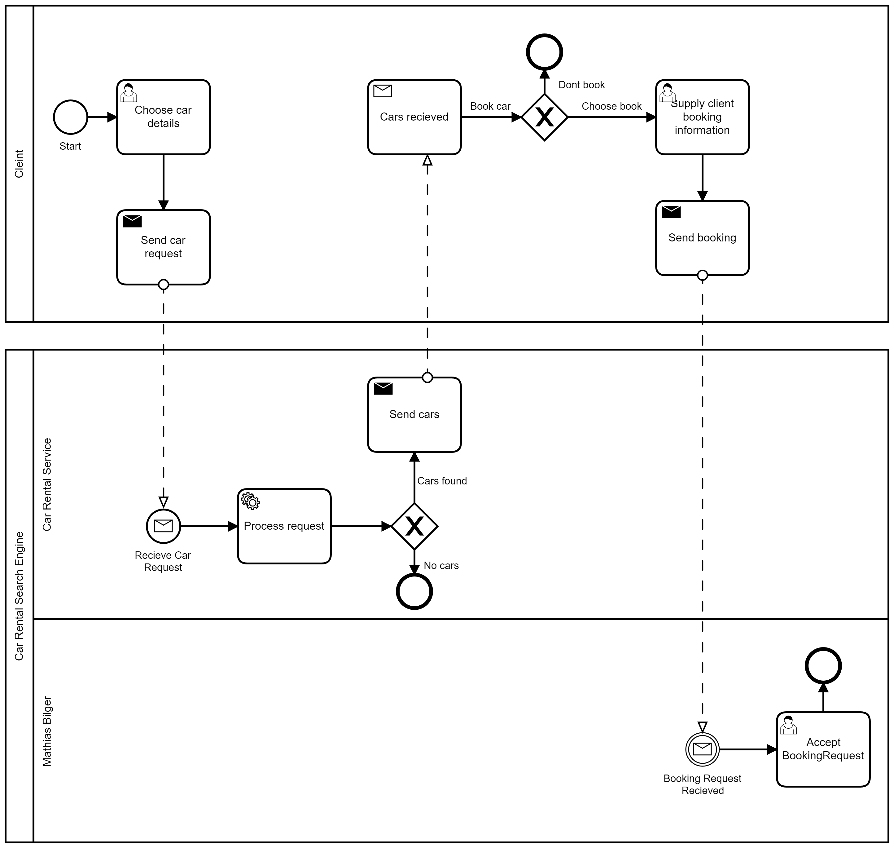

# System Integration Mini Project 2: EIP

Assignment: [Link to PDF](https://github.com/datsoftlyngby/soft2019fall-si/blob/master/docs/MiniProjects/GP2.pdf)

## Authors Details
- Mathias Bigler (cph-mb493@cphbusiness.dk)
- Stanislav Novitski (cph-sn183@cphbusiness.dk) 
- Alexander Winther Hørsted-Andersen (cph-ah353@cphbusiness.dk)

## Overview

We have creat a system that uses MOM as an integration platform. Our setup of MOM is done by setting up a
[RabbitMQ](https://www.rabbitmq.com/) server on one of our servers. Specifically on www.mathiasbigler.com:15672.

The RabbitMQ instance runs in a Docker container instantiated
by this command: 
````
docker run -d -p 15672:15672 -p 5672:5672 -p 5671:5671 --hostname my-rabbitmq --name my-rabbitmq-container rabbitmq:3-management
````

## Business Process



## Requirements
Integration Platform:
- 